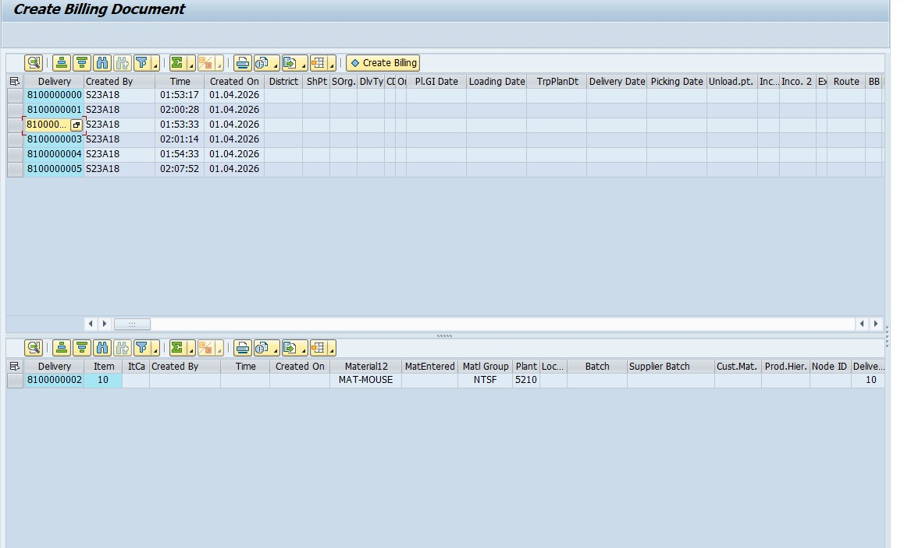

# 🏭 SAP O2C Cockpit (Order to Cash 통합 관리 및 전표 자동 생성 시스템)
SAP SD Module Process Automation: One-click generation of SO, DO, GI, and Billing documents.

    

## 🚀 프로젝트 소개
#### "표준 SAP 환경에서 각 전표(SO, DO, GI, Billing)를 개별 트랜잭션으로 처리할 때 발생하는 수작업의 비효율과 데이터 누락 리스크를 어떻게 해결할까?" 

이 질문이 본 O2C Cockpit 프로젝트의 출발점이었습니다. 기존 ERP 환경에서는 영업부터 물류, 회계로 이어지는 흐름을 파악하기 위해 여러 트랜잭션 코드를 오가며 확인해야 하는 불편함이 있었습니다.

이를 해결하기 위해 SAP SD(판매/물류) 모듈의 O2C 프로세스를 철저히 분석하여, **모든 흐름을 한눈에 모니터링하고 다단계 전표 생성을 원클릭으로 자동화하는 '통합 관제탑(Cockpit)' 프로그램(`ZR18A00060`)**을 설계했습니다. 단순한 UI 개발을 넘어, 글로벌 클래스(`ZCL18_LEC_AUTO_PLAN`)를 활용한 객체지향적 설계와 철저한 사전 검증(Pre-check) 로직을 통해 기업 데이터의 무결성을 끝까지 책임지는 견고한 아키텍처를 구축하는 데 집중했습니다.

  

### 🛠️ 주요 기능 (Key Features)

| 기능 | 설명 | 관련 기술/객체 |
| :---: | --- | :---: |
| **다단계 전표 자동 생성 엔진** (Auto-Process) | 사용자의 원클릭(Auto Process)으로 PO(구매오더) 기반의 **SO(영업오더) → DO(납품) → GI(출고) → Billing(대금청구)** 과정을 순차적으로 자동 생성합니다. BAPI와 글로벌 클래스 연동을 통해 수작업 대비 처리 속도를 획기적으로 향상시켰습니다. | `BAPI`, `Global Class` `(ZCL18_LEC_AUTO_PLAN)` |
| **사전 검증(Pre-check) 기반 데이터 무결성 확보** | 전표 연쇄 생성 시, **"이전 단계 미완료 시 다음 단계 진행 불가"** 라는 비즈니스 규칙을 서브루틴으로 구현했습니다. 선행 문서의 존재 여부와 생성 가능 상태를 실시간 체크하여 논리적 예외를 차단합니다. | `ABAP Subroutine` `Logical Validation` |
| **Master-Detail 통합 UI/UX** | Splitter 및 Docking Container를 활용해 화면을 분할하고, 상단(헤더 현황)과 하단(상세 아이템) 간의 데이터를 실시간으로 연동합니다. 각 전표의 진행 상태를 아이콘과 강조 컬러(C110, C300 등)로 시각화하여 가시성을 높였습니다. | `OO-ALV Grid` `Splitter Container` `Screen Painter` |
| **대용량 데이터 조회 성능 최적화** (Selective Refresh) | 데이터 변경 시 전체를 재조회(Refresh)하여 발생하는 DB 부하를 막기 위해, **변경 플래그(Flag)와 특정 레코드 인덱스(Row-level)를 추적하여 필요한 행만 선택적으로 갱신**하는 로직을 적용했습니다. 또한 `FOR ALL ENTRIES` 최적화와 `Sorted/Secondary Key`를 적용했습니다. | `Open SQL Tuning` `Partial Update` |
| **동적 CBO 권한 제어 및 마스터 관리** | 내부 통제 원칙 준수를 위해 사용자 권한 관리 테이블(`ZT18ACOM10`)을 직접 설계했습니다. 로그인 유저(`sy-uname`)에 따라 ALV 툴바 버튼 활성화 및 셀 편집 권한을 동적으로 제어하며, 마스터 데이터를 관리하는 별도 프로그램(`ZR18A00070`)을 구현했습니다. | `CBO Table Design` `Authority Check` |

  

## 👤 개발자 (1인 개발 Full-Cycle)

| **박규태 (ZaRi1l)**|
|:---:|

#### 💡 담당 업무 (100% 단독 수행)
*   **비즈니스 아키텍처 & 백엔드 로직 (ABAP OO)**
    *   SAP SD 모듈 O2C 프로세스 흐름 분석 및 데이터 모델링
    *   글로벌 클래스(`ZCL18_LEC_AUTO_PLAN`) 설계 및 BAPI 호출 모듈화 (`ZZ_GET_SO_RTN` 등)
    *   Pre-check 서브루틴을 통한 다단계 데이터 정합성 검증 엔진 구현
*   **프론트엔드 & UI/UX (SAP GUI)**
    *   `Screen Painter(SE51)`를 활용한 Custom Control 영역 할당 및 화면 레이아웃 설계
    *   객체지향 ALV(`CL_GUI_ALV_GRID`) 기반 Master-Detail 화면 구현
    *   상태값에 따른 동적 아이콘 및 컬러 스타일링 적용
*   **데이터베이스 & 성능 튜닝 (Open SQL)**
    *   CBO 권한 마스터 테이블 설계 및 관리 프로그램 구현
    *   `FOR ALL ENTRIES` 튜닝 및 `Secondary Key` 기반 데이터 탐색 속도 극대화
    *   시스템 리소스 최적화를 위한 Selective Refresh(부분 갱신) 전략 설계

  

## 💻 개발 환경 및 기술 스택

| 구분 | 사용 기술 및 도구 |
|:---:|:---|
| **Language** |  |
| **ERP Module** |   |
| **UI Framework** |   `Screen Painter` `Splitter Container` |
| **Database** |  `CBO Table Design` |
| **Architecture** | `Global Class (SE24)` `BAPI` `Authority-Check` |

  

## 🧩 문제 해결 및 성장 경험 (Troubleshooting)

### 1. 리소스 최적화와 사용자 편의를 고려한 리프레시(Refresh) 전략
*   **상황:** 데이터 변경 시마다 전체 테이블을 재조회(SELECT)할 경우, 대용량 데이터 환경에서 **과도한 DB 부하가 발생**하고 사용자의 작업 흐름(스크롤 위치 등)이 끊기는 문제가 발생했습니다.
*   **해결:** 웹 개발에서 익힌 '부분 업데이트(Partial Update)' 개념을 ABAP에 적용했습니다. **데이터 변경 여부를 감지하는 플래그(Flag) 변수**를 활용하고, 변경된 특정 레코드의 인덱스를 추적하여 **필요한 행(Row)만 타겟 업데이트**하는 로직을 설계했습니다.
*   **결과:** 불필요한 DB 트래픽을 차단하여 시스템 리소스를 최적화하고, 대규모 트랜잭션 상황에서도 안정적인 실시간 처리 성능을 확보했습니다.

### 2. 철저한 사전 검증(Pre-check) 로직을 통한 데이터 무결성 확보
*   **상황:** O2C 연쇄 전표 생성 시, 선행 전표가 누락되거나 이미 완료된 전표를 중복 생성하게 되면 기업의 물류/재무 데이터가 꼬이는 치명적인 에러가 발생할 수 있었습니다.
*   **해결:** BAPI 호출 전, **선행 문서의 존재 여부와 현재 문서의 생성 가능 상태를 단계별로 검증**하는 서브루틴을 촘촘하게 설계했습니다. 인터널 테이블의 인덱스를 추적해 논리적 오류를 사전에 판별했습니다.
*   **결과:** 사용자의 잘못된 조작에도 시스템의 데이터 정합성을 완벽하게 보장하는 방어적 설계(Defensive Design)를 완성했습니다.

  

제공해주신 `00`, `10`, `20`, `30`번 프로그램을 포함한 전체 코드를 분석하여, **"주요 기능(Key Features)"**과 **"주요 프로그램 구성(Repository Objects)"** 부분을 더욱 풍성하고 정확하게 업데이트해 드립니다.

규태 님의 프로젝트는 **모듈화된 개별 프로세스 프로그램(10~50)**과 이를 하나로 묶은 **통합 콕핏(60)**, 그리고 **표준 템플릿(00)** 및 **마스터 관리(70)**까지 갖춘 매우 체계적인 "ERP 솔루션 패키지" 형태를 띠고 있음을 확인했습니다.

---

### 📁 주요 프로그램 (Repository Objects) 구성 - 전체 리스트

제공해주신 모든 소스 코드를 순서대로 정리한 리스트입니다.

| 프로그램 ID | 유형 | 프로그램 제목 (Title) | 핵심 역할 및 특징 |
| :--- | :---: | :--- | :--- |
| **`ZR18A00000`** | `Template` | **Program Templet** | 전체 프로젝트의 기반이 되는 **표준 템플릿**. 동일한 GUI Status와 Screen 2000 구조를 제공하여 개발 생산성을 높임. |
| **`ZR18A00010`** | `Step 1` | **Create Sales Order by PO** | **구매오더(PO) 기반 영업오더(SO) 생성**. 검색 조건(`SO_EBELN`, `SO_AEDAT`)을 통해 대상 PO를 추출하고 SO로 변환함. |
| **`ZR18A00020`** | `Step 2` | **Create Delivery Order by SO** | **영업오더(SO) 기반 납품오더(DO) 생성**. 생성 화면(`2000`)과 상세 조회 화면(`3000`)을 분리하여 데이터 검증 강화. |
| **`ZR18A00030`** | `Step 3` | **Create Good Issue by DO** | **납품오더(DO) 기반 출고(GI) 처리**. 재고의 물리적 이동을 기록하고 문서 상태를 `Update G/I`함. |
| **`ZR18A00040`** | `Step 4` | **Create Billing Document** | **최종 대금 청구(Billing) 생성**. GI가 완료된 문서를 대상으로 재무 전표 생성을 준비함. |
| **`ZR18A00050`** | `Inquiry` | **Display Billing Document** | 생성된 Billing 전표를 확인하기 위한 **전용 조회 모듈**. |
| **`ZR18A00060`** | **Cockpit** | **SY Purchase Auto Processing** | **프로젝트의 메인 컨트롤러**. 10~50번의 기능을 통합하여 'One-click Auto Process' 엔진을 가동함. |
| **`ZR18A00070`** | `Master` | **SY Unit Common Condition Master** | **CBO 권한 및 조건 마스터 관리**. `SAVE` 기능을 통해 운영 중 실시간으로 설정 변경 가능. |
| **`ZCL18_LEC...`** | `Class` | **Logistics Business Logic** | 모든 전표 생성의 핵심 로직(BAPI 호출 등)을 담은 **글로벌 클래스**. |

---

  

## 🖼️ 주요 기능 화면 (Screenshots)

 
 

