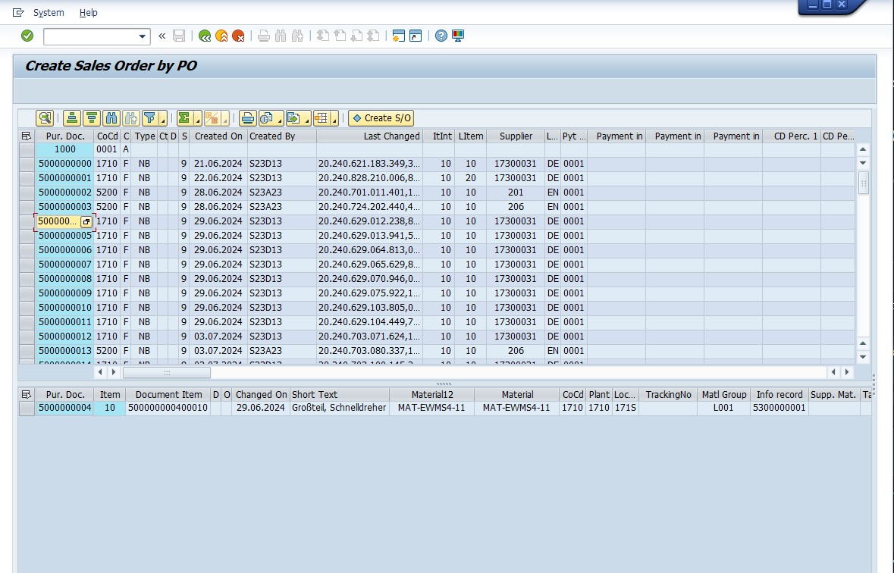
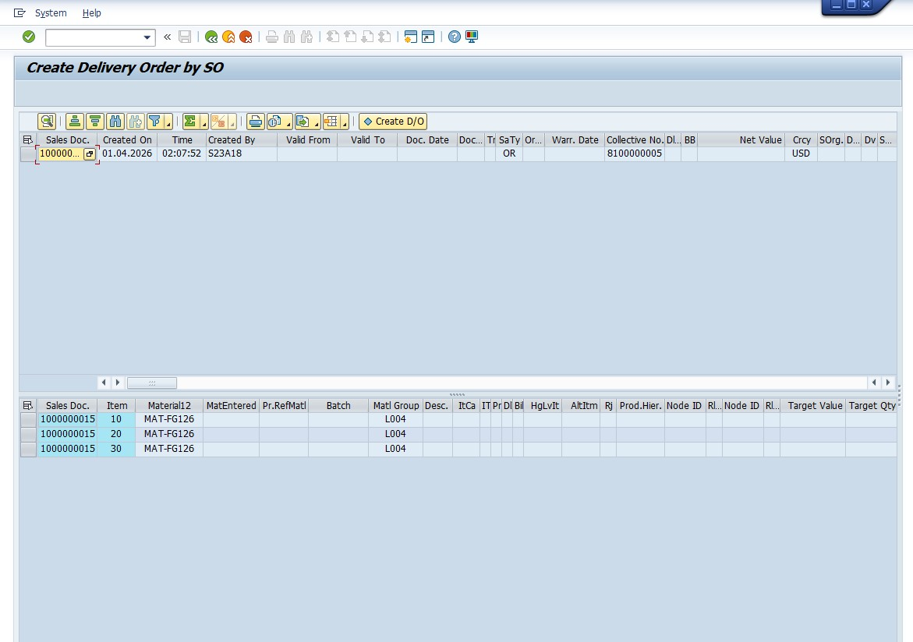
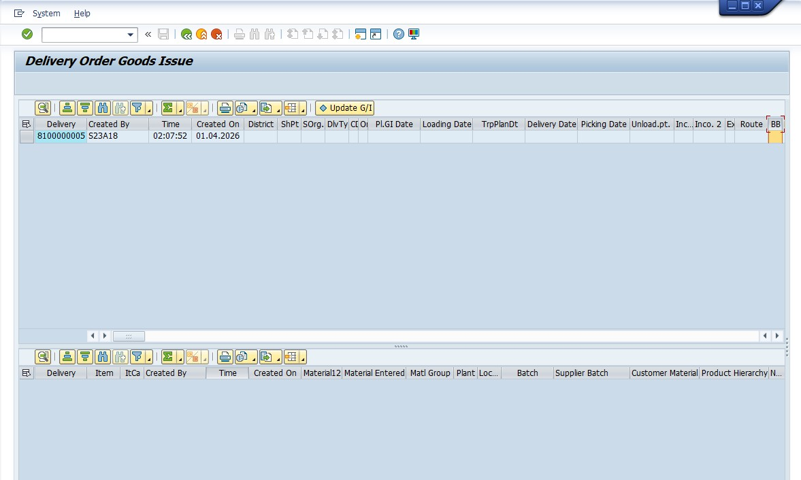
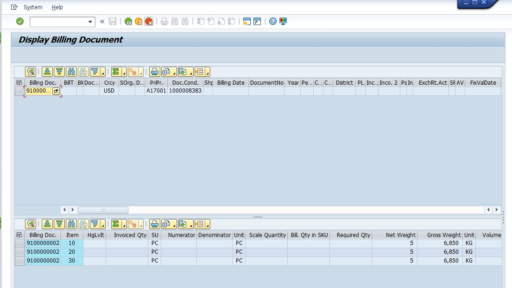

## 🖼️ 구현 화면 및 비즈니스 프로세스 흐름

### 1. 개별 프로세스 모듈 (Step-by-Step)
통합 콕핏의 기반이 되는 개별 전표 생성 및 조회 프로그램입니다.

#### [Step 1] 구매오더 기반 영업오더 생성 (ZR18A00010)

#### [Step 2] 영업오더 기반 납품오더 생성 (ZR18A00020)

#### [Step 3] 납품오더 기반 출고 처리 (ZR18A00030)

#### [Step 4] 대금 청구 전표 생성 (ZR18A00040)

#### [Step 5] 대금 청구 전표 상세 조회 (ZR18A00050)

 

### 2. 통합 비즈니스 Cockpit (ZR18A00060)
분산된 O2C 프로세스를 하나의 인터페이스에서 통합 관리합니다.

#### 콕핏 초기 실행 및 검색 화면

#### 통합 관제 대시보드 (ALV 메인 화면)

 

### 3. 철저한 사전 검증 로직 (Pre-check)
데이터 무결성을 보장하기 위해 각 단계별 선행 문서 존재 여부 및 중복 생성을 실시간으로 검증합니다.

#### 선행 문서 누락 및 중복 생성 방지 알림
| 구분 | 검증 화면 |
| :--- | :--- |
| **선행 문서 없음** |  |
| **선행 문서 없음2** |  |
| **SO 중복 생성 방지** |  |
| **DO 중복 생성 방지** |  |
| **GI 중복 처리 방지** |  |
| **BI 중복 청구 방지** |  |

#### 프로세스 흐름 통제 (Auto-Process 불가 상황)
권한이 없는 경우 오토 프로세스 차단

.jpg)

 

### 4. CBO 권한 및 마스터 관리 (ZR18A00070)
시스템 보안과 내부 통제를 위해 사용자별 권한을 동적으로 제어합니다.

#### 사용자별 기능 권한 설정 마스터

#### 권한 제어 적용 (버튼 비활성화 및 접근 제한)

